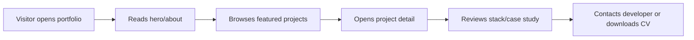
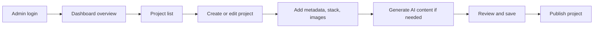
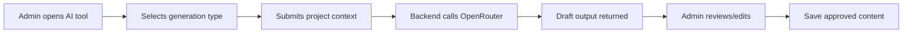

# ProjectBowl — Phase 1: Project Planning & Requirement

> Status: Completed planning draft  
> Date: 2026-05-27  
> Phase focus: planning only — no application code yet.

## 1. Project Overview

**ProjectBowl** is an AI-powered project management and portfolio CMS for developers. It combines a public personal portfolio website with a private admin dashboard for managing projects, publishing portfolio content, and generating project-related writing with AI.

The product should help a developer turn raw project ideas, repositories, screenshots, and notes into polished portfolio entries, README files, and case studies.

## 2. Main Goal

Build a fullstack application that allows the owner/admin to:

- Showcase profile, skills, tech stack, and projects through a premium public portfolio.
- Manage projects from a private dashboard.
- Generate project descriptions, README files, case studies, and improved text using OpenRouter-powered AI.
- Review AI output before saving or publishing.
- Publish selected projects publicly while keeping drafts/private projects hidden.

## 3. Target Users

### Primary User

**Portfolio owner / developer admin**

- Wants a polished personal portfolio.
- Wants to manage project content without manually editing code.
- Wants AI assistance for writing descriptions, READMEs, and case studies.
- Needs a private dashboard for managing project metadata, status, media, and publication state.

### Secondary Users

**Visitors / recruiters / clients**

- Browse the public portfolio.
- View featured projects and detailed case studies.
- Understand the developer's skills, stack, and working style.
- Contact the developer or download CV.

### Future Users

**Other developers / SaaS users**

- Could eventually use ProjectBowl as a reusable portfolio CMS product.
- Could manage multiple projects, AI outputs, and public showcases from one system.

## 4. Product Scope

ProjectBowl has two major parts:

### 4.1 Public Portfolio Website

The public website presents the developer profile and published project content.

Planned sections/pages:

- Home page
- About section
- Skills section
- Featured projects section
- Project detail page
- ProjectBowl showcase section
- AI features section
- Tech stack section
- Contact section
- CV download button

Important requirement:

- Project data should eventually come from the backend API.
- Dummy/static project data can be used temporarily during early UI development.
- Only published/public projects should appear on the public portfolio.

### 4.2 Private ProjectBowl Dashboard

The dashboard is the admin workspace for managing portfolio and project content.

Planned dashboard features:

- Admin login
- Dashboard overview
- Project list
- Create project
- Edit project
- Delete project
- Public/private project toggle
- Project status management
- Tech stack management
- Thumbnail/screenshot upload
- AI generator tools
- Settings page

## 5. Main Features

### Public Portfolio Features

- Landing hero with personal branding and call-to-action buttons.
- About/bento section describing background and current focus.
- Skills and tech stack display.
- Featured project cards.
- Project detail pages by slug.
- ProjectBowl flagship showcase section.
- AI feature showcase section.
- Contact section with email, social links, and CTA.
- CV download button.
- SEO metadata for public pages.

### Dashboard Features

- Secure admin authentication.
- Project CRUD.
- Project publishing controls.
- Project status tracking.
- Tech stack assignment.
- Image upload/management.
- AI content generation tools.
- AI output review before saving.
- Dashboard summary/overview.

### AI Features

All AI calls must go through the backend. The frontend must not call OpenRouter directly.

Planned AI capabilities:

- Generate project description.
- Generate GitHub README.
- Generate portfolio case study.
- Improve existing text.
- Translate Indonesian / English.

AI output flow:

1. Admin enters project/context data.
2. Frontend sends request to backend AI endpoint.
3. Backend calls OpenRouter API.
4. Backend validates and returns draft output.
5. Admin reviews and edits the output.
6. Admin saves the approved output.
7. AI generation log is stored in database.

## 6. User Flow

### 6.1 Public Visitor Flow



### 6.2 Admin Project Management Flow



### 6.3 AI Generation Flow



## 7. Planned Tech Stack

### Frontend

- Next.js
- TypeScript
- Tailwind CSS
- Shadcn UI
- Framer Motion

### Backend

- Node.js
- NestJS
- TypeScript
- Prisma

### Database

- PostgreSQL

### AI Integration

- OpenRouter API

### Authentication

- JWT access token
- Refresh token

### Storage

- Cloudinary

### API Documentation

- Swagger / OpenAPI

### Testing

- Jest
- Supertest

### DevOps

- Docker
- GitHub Actions

### Deployment

- Frontend: Vercel
- Backend: Railway or Render
- Database: Neon or Supabase PostgreSQL
- Image storage: Cloudinary

## 8. Design Direction

ProjectBowl should follow a dark Framer-inspired portfolio style.

### Visual Style

- Dark mode first.
- Fun but still professional.
- Futuristic developer portfolio.
- Bento grid layout.
- Glassmorphism cards.
- Purple and cyan neon accents.
- Rounded UI.
- Smooth animations.
- Clean and premium appearance.

### Suggested Colors

| Token | Value | Usage |
|---|---:|---|
| Main background | `#080A0F` | App/page background |
| Card background | `#111827` | Cards and panels |
| Card hover | `#161E2E` | Hovered card states |
| Border | `#263142` | Card/input borders |
| Primary text | `#F9FAFB` | Main text |
| Secondary text | `#9CA3AF` | Muted text |
| Primary accent | `#7C3AED` | Purple accent |
| Secondary accent | `#06B6D4` | Cyan accent |
| Success accent | `#A3E635` | Success/online state |

### Figma Alignment Notes

Existing Figma design direction includes:

- Dark background.
- Glassmorphism cards.
- Purple/cyan gradient accents.
- Portfolio home page with hero, about, projects, ProjectBowl feature, AI features, stack, and contact.
- Contact page with dark form layout, budget selector, contact info cards, and FAQ.

Known Figma frames:

- Home page: `6:3259`
- Contact page: `6:2964`

## 9. Backend Module Planning

Initial NestJS modules:

- `auth` — login, logout, JWT, refresh token, guards.
- `users` — admin user model and account data.
- `projects` — project CRUD and public project endpoints.
- `tech-stacks` — tech stack CRUD and assignment.
- `project-images` — project screenshots/thumbnails metadata.
- `ai` — OpenRouter integration and AI generation endpoints.
- `uploads` — Cloudinary upload handling.
- `dashboard` — summary data for admin overview.

Future modules:

- `tasks`
- `milestones`
- `activity-logs`

## 10. Initial Database Planning

### User

Stores admin account information.

Suggested fields:

- `id`
- `name`
- `email`
- `passwordHash`
- `role`
- `refreshTokenHash`
- `createdAt`
- `updatedAt`

### Project

Stores portfolio/project data.

Suggested fields:

- `id`
- `title`
- `slug`
- `summary`
- `description`
- `caseStudy`
- `readmeContent`
- `repositoryUrl`
- `liveUrl`
- `thumbnailUrl`
- `status`
- `visibility`
- `isFeatured`
- `publishedAt`
- `createdAt`
- `updatedAt`

Possible enums:

- `ProjectStatus`: `IDEA`, `PLANNING`, `IN_PROGRESS`, `SHIPPED`, `ARCHIVED`
- `ProjectVisibility`: `PRIVATE`, `PUBLIC`

### TechStack

Stores reusable technology labels.

Suggested fields:

- `id`
- `name`
- `slug`
- `category`
- `iconUrl`
- `createdAt`
- `updatedAt`

Possible categories:

- `FRONTEND`
- `BACKEND`
- `DATABASE`
- `AI`
- `DEVOPS`
- `DESIGN`
- `OTHER`

### ProjectTechStack

Join table between projects and tech stacks.

Suggested fields:

- `projectId`
- `techStackId`
- `createdAt`

### ProjectImage

Stores project images/screenshots.

Suggested fields:

- `id`
- `projectId`
- `url`
- `publicId`
- `altText`
- `sortOrder`
- `type`
- `createdAt`
- `updatedAt`

Possible image types:

- `THUMBNAIL`
- `SCREENSHOT`
- `COVER`

### AiGenerationLog

Stores AI usage history and generated drafts.

Suggested fields:

- `id`
- `userId`
- `projectId`
- `type`
- `provider`
- `model`
- `prompt`
- `input`
- `output`
- `status`
- `createdAt`

Possible generation types:

- `PROJECT_DESCRIPTION`
- `README`
- `CASE_STUDY`
- `IMPROVE_TEXT`
- `TRANSLATE`

Possible statuses:

- `SUCCESS`
- `FAILED`

### Future Models

- `Task`
- `ProjectMilestone`
- `ActivityLog`

## 11. Recommended Folder Structure

Planned monorepo structure:

```txt
project-bowl/
├── apps/
│   ├── web/
│   │   ├── app/
│   │   ├── components/
│   │   ├── features/
│   │   ├── lib/
│   │   └── public/
│   └── api/
│       ├── src/
│       │   ├── auth/
│       │   ├── users/
│       │   ├── projects/
│       │   ├── tech-stacks/
│       │   ├── project-images/
│       │   ├── ai/
│       │   ├── uploads/
│       │   ├── dashboard/
│       │   └── common/
│       └── prisma/
├── packages/
│   ├── config/
│   ├── types/
│   └── ui/
├── docs/
│   ├── phase-1-project-planning.md
│   ├── api.md
│   ├── database.md
│   └── deployment.md
├── .github/
│   └── workflows/
├── docker-compose.yml
├── package.json
├── pnpm-workspace.yaml
├── turbo.json
└── README.md
```

Note: the folder structure above is planning only. Actual folders should be created in later setup phases.

## 12. Development Roadmap

### Phase 1 — Project Planning & Requirement

- Define project goal.
- Define target users.
- Define main features.
- Define user flow.
- Define tech stack.
- Define folder structure.
- Create initial database planning.
- Create development roadmap.

### Phase 2 — Setup Monorepo

- Setup GitHub repository.
- Setup pnpm workspace.
- Setup Turborepo.
- Setup Next.js frontend.
- Setup NestJS backend.
- Setup shared packages.
- Verify frontend and backend can run locally.

### Phase 3 — Design System & UI Foundation

- Define Tailwind theme tokens.
- Setup Shadcn UI.
- Setup Framer Motion.
- Build reusable UI components.
- Build navbar, sidebar, dashboard layout, and responsive foundations.

### Phase 4 — Public Portfolio Static Page

- Implement public homepage sections.
- Add dummy project data.
- Implement project detail page shell.
- Match Figma dark portfolio design direction.

### Phase 5 — Backend Core Setup

- Setup NestJS architecture.
- Setup Prisma and PostgreSQL.
- Setup environment variables.
- Setup validation, CORS, error handling, and health endpoint.

### Phase 6 — Database Schema & Project CRUD API

- Implement Prisma models.
- Create migrations.
- Build project service/controller/DTOs.
- Add public project endpoints.
- Test with Postman.

### Phase 7 — Authentication & Authorization

- Implement admin user system.
- Add login/logout.
- Add JWT access token and refresh token.
- Add guards and protect dashboard endpoints.

### Phase 8 — ProjectBowl Dashboard

- Build dashboard pages.
- Connect dashboard forms to backend.
- Add project status, visibility, tech stack, image upload, and validation.

### Phase 9 — Connect Portfolio to Backend API

- Replace dummy project data with API data.
- Fetch and display published projects.
- Add loading, error, empty states, and SEO metadata.

### Phase 10 — AI Integration with OpenRouter

- Setup OpenRouter service.
- Add AI prompt templates and generation endpoints.
- Save generation logs.
- Build dashboard AI generator UI.

### Phase 11 — Project Management Features

- Add tasks, milestones, progress tracking, search/filter, and activity logs.

### Phase 12 — Documentation, Testing, DevOps & Deployment

- Add Swagger docs, README, environment guides, tests, Docker, GitHub Actions, and production deployment.

## 13. Phase 1 Completion Checklist

- [x] Define project goal
- [x] Define target users
- [x] Define main features
- [x] Define user flow
- [x] Define tech stack
- [x] Define folder structure
- [x] Create initial database planning
- [x] Create development roadmap

## 14. Next Step

Proceed to **Phase 2 — Setup Monorepo** after reviewing this planning document.
